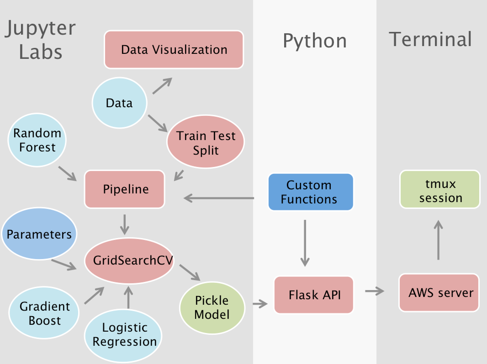

# LL MiniProject 4: Loan Classification Pipeline
Mini-project with one day allotted. The focus for this project was using Pipelines to optimize ML workflow and Flask to create an API within an AWS server. The work flow went as follows:

Initial data visualization, feature selection, and model training can all be found in `DataPipeline.py`. The trained model was exported to `loan_model.sav` where it is then accessed through flask code in `loan_flask.py`. When `loan_flask.py` is run the API call accepts parameters as a dictionary of input features describing a loan and will return the probability of loan acceptance. 
